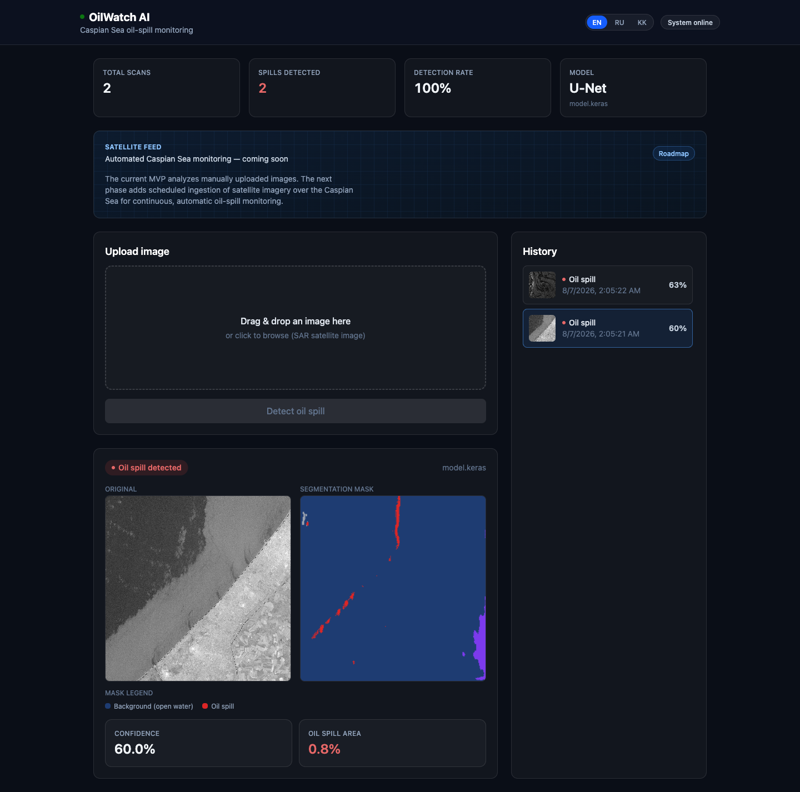
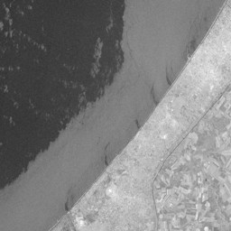
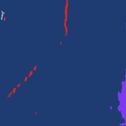

# OilWatch AI

Detects oil spills / oil-contaminated areas in **SAR (Synthetic Aperture Radar) satellite images** using a Hugging Face computer vision model, with a Django REST API backend and a React dashboard frontend.

<p align="center">
  
</p>

<p align="center">
  
  &nbsp;&nbsp;&nbsp;
  
</p>
<p align="center"><sub>Left: raw Sentinel-1 SAR input (ESA, 28 June 2017) · Right: predicted segmentation mask (red = detected oil spill)</sub></p>

## What this MVP does

- Upload an image (SAR satellite imagery — see [Test images](#test-images) below) through the dashboard.
- The backend runs a 5-class semantic segmentation model (U-Net) to classify each pixel as `background`, `oil_spill`, `ships`, `look_alike`, or `wakes`. The dashboard's mask legend only surfaces `background`/`oil_spill` — the other three are model-internal detail, not user-facing signal.
- The dashboard shows the original image, a color-coded segmentation mask, confidence, and the estimated oil-spill area, and keeps a history of past scans.
- On first run (empty database), two real, verified SAR predictions are seeded automatically so the dashboard isn't empty — see [`seed_demo_data`](backend/predictions/management/commands/seed_demo_data.py).

The current MVP analyzes manually uploaded images. Automated ingestion of a live satellite feed for continuous Caspian Sea monitoring is on the roadmap (see `tasks/roadmap.md`).

## Minimum system requirements

- Docker Engine 20.10+ and Docker Compose v2
- ~4 GB RAM available to Docker (TensorFlow inference)
- Internet access on first run (the model weights are downloaded from Hugging Face on the first prediction)

No local Python/Node installation is required — everything runs in Docker.

## Tech stack

- **Backend**: Python 3.13, Django 5, Django REST Framework, TensorFlow/Keras, PostgreSQL
- **Frontend**: React, TypeScript, Vite, TailwindCSS
- **Infrastructure**: Docker, Docker Compose

## Running the project

```bash
cp .env.example .env
docker compose up --build
```

nginx is the single entry point (port 80) in front of the frontend build, the backend API, and media/static files — everything is reachable through one origin, so on a real server just point a browser at the server's IP with no port needed:

| What | URL |
|---|---|
| Dashboard | http://localhost/ |
| Backend API | http://localhost/api/ |
| API docs (Swagger) | http://localhost/api/docs/ |
| Django admin | http://localhost/admin/ |

Migrations run automatically on backend startup, and a Django admin superuser is created automatically from `DJANGO_SUPERUSER_*` in `.env` (default: `admin` / `admin` — change this before deploying beyond the hackathon demo). No manual database setup is required for the core flow (upload → predict → history). The frontend is built once at `docker compose up --build` time (no hot reload) and served as static files by nginx — re-run `--build` after frontend changes.

## API endpoints

```
POST /api/predict/   # multipart/form-data, field "image" -> prediction result
GET  /api/history/    # list of past predictions
```

## Test images

The model is trained on **raw SAR radar imagery**, not ordinary optical photos — oil slicks appear as dark, textured patches rather than the bright/pale swirls seen in optical satellite photos (e.g. MODIS). It also expects an **unannotated grayscale radar scene**, not a rendered infographic/map (colored land/water composites, text labels, legends, arrows). We verified this empirically with two real spills, both auto-seeded into the database on first run (see above) and also available directly in `backend/predictions/fixtures/`:

- `sentinel-1-oil-spill-esa-2017.png` — a real, raw Copernicus Sentinel-1 SAR image (28 June 2017), sourced from [ESA](https://www.esa.int/ESA_Multimedia/Images/2017/06/Oil_spill_detected_by_Sentinel-1) (ESA Standard Licence, contains modified Copernicus Sentinel data). Correctly classified as `oil_spill`, ~0.8% oil-spill area matching the visible dark streak in the scene.
- `terrasar-x-oil-spill-2010.jpg` — a real TerraSAR-X radar image of the Deepwater Horizon spill (Gulf of Mexico, 9 July 2010), sourced from [Wikimedia Commons](https://commons.wikimedia.org/wiki/File:TerraSAR-X_image_of_the_oil-polluted_area_in_the_Gulf_of_Mexico_in_a_series_of_images_acquired_on_9_July_2010.jpg) (CC BY 3.0, DLR). Correctly classified as `oil_spill`, ~1.8% oil-spill area.

For contrast, a rendered infographic of the Balikpapan Bay spill (colored land/water, text labels) was **misclassified** (0% oil_spill, 53.8% falsely labeled `ships`) — the model does not generalize to annotated/composite imagery, only to raw radar scenes.

Ordinary optical/aerial photos (regular camera or visible-light satellite photos) and pre-rendered maps/infographics are **not** representative inputs for this model. Use a raw, unannotated SAR scene for a meaningful demo.

## Project structure

```
backend/
  config/            # Django project settings
  predictions/
    api/             # serializers, views, urls — thin, no business logic
    services/        # PredictionService + OilSpillModel abstraction (Hugging Face model boundary)
    models.py        # Prediction model
frontend/
  src/
    components/      # UploadPanel, ResultCard, HistoryList, dashboard widgets
    services/        # API client
docker/
  nginx/             # nginx config: reverse proxy + static frontend + media/static file serving
tasks/               # roadmap/backlog/todo/done (in Russian — project task tracking)
```

## Model

- Source: [sahilvishwa2108/oil-spill-unet](https://huggingface.co/sahilvishwa2108/oil-spill-unet) (U-Net, 5-class segmentation)
- The model is abstracted behind `PredictionService`/`OilSpillModel` (`backend/predictions/services/`) so it can be swapped without touching API or business logic.
- The model card does not name its training dataset. Based on the class set (`background, oil_spill, ships, look_alike, wakes`) and its empirically confirmed accuracy on raw Sentinel-1 scenes, it was most likely trained on a Sentinel-1 SAR oil-spill dataset (e.g. the public "M4D"/Kaggle-style 5-class SAR datasets) — this is an informed guess, not a documented fact, and is worth re-verifying if this model is used beyond the MVP.

## Why SAR, not ordinary satellite photos?

"Satellite image" usually means an ordinary optical photo (visible light, like Google Maps or a phone camera from orbit — e.g. Sentinel-2, Landsat, MODIS). **SAR (Synthetic Aperture Radar)** is a different kind of satellite sensor: it actively sends radar pulses and measures what bounces back, rather than passively capturing light. That distinction is why this model requires SAR input specifically, not any "satellite image":

| | SAR (radar) | Optical (visible light) |
|---|---|---|
| How oil is detected | Physics-based: a smooth oil film dampens radar backscatter, showing up as a dark patch — reliable, hard to fake | Appearance-based: color/brightness/spectral differences — oil can look like sun glint, algae, or clean water depending on lighting |
| Weather / day-night | Works through clouds, at night, in any weather | Needs clear skies and daylight |
| Data cost | Sentinel-1 (ESA/Copernicus) is free and open | Sentinel-2/Landsat (ESA/NASA) are also free; higher-resolution commercial imagery (Planet, Maxar) costs money per km² |
| Ease of use | Grayscale, textured, harder to read by eye; more false positives from look-alikes (algae, calm-wind slicks, biogenic films) | Intuitive to interpret visually; easier to label training data |

For continuous real-world monitoring (the Caspian Sea roadmap item), SAR is generally the better fit precisely because it doesn't depend on weather or daylight — an oil spill doesn't wait for clear skies. Models for optical imagery also exist (typically CNN classifiers/segmenters on Sentinel-2 or commercial RGB imagery), but none of comparable quality were found packaged on Hugging Face during this project's research (see `tasks/done.md` for the survey).
